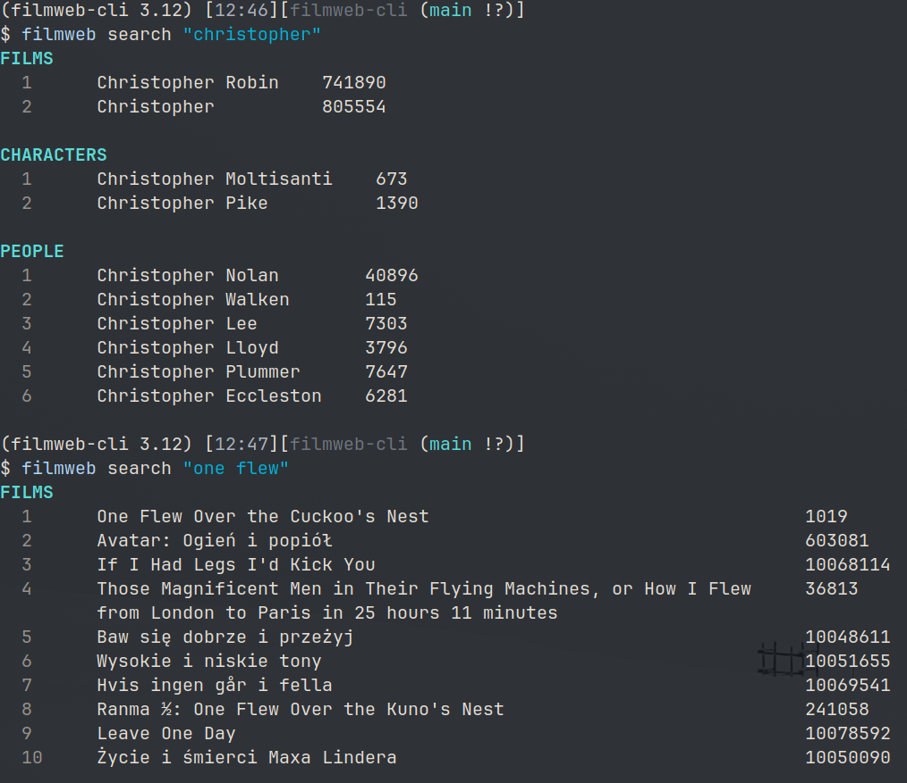
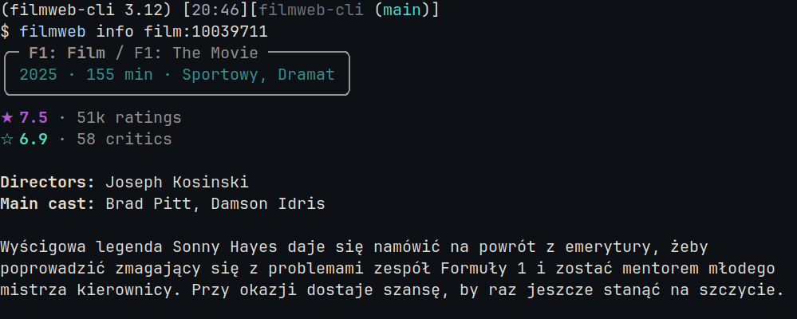
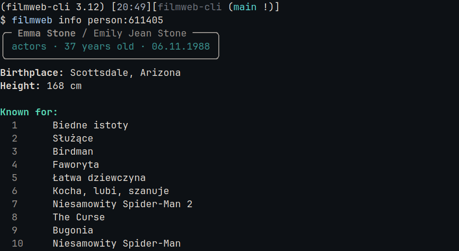
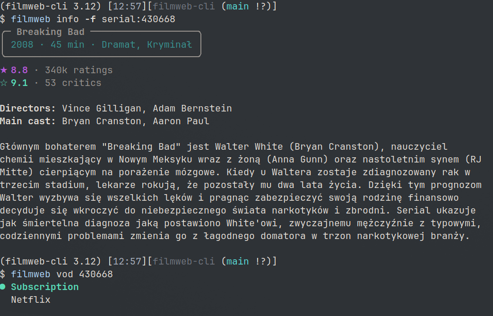
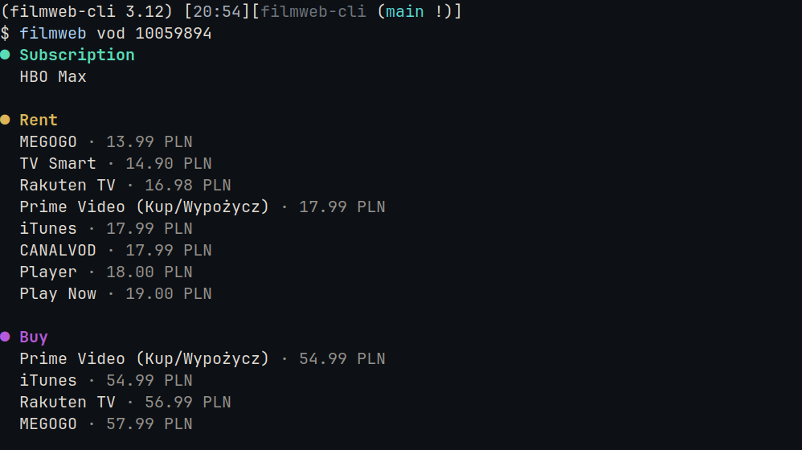
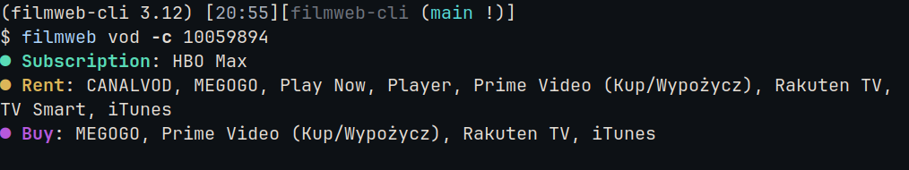
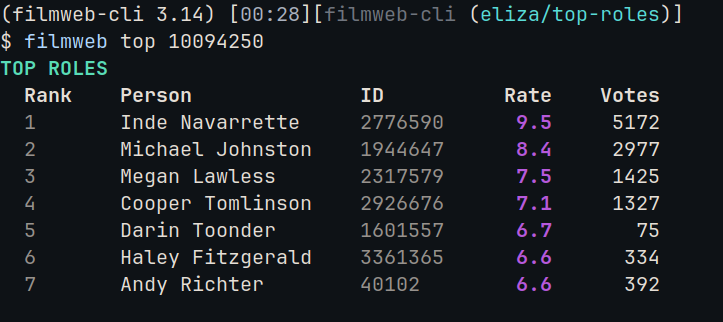

# filmweb-cli

A command-line interface for accessing [Filmweb.pl](https://www.filmweb.pl/) data directly from terminal. Search for films, series, games, characters, people, and fictional worlds, with detailed information and VOD availability.

## Features

- Search across multiple content types: films, series, games, characters, people, and fictional worlds
- Display detailed information including ratings, descriptions, cast, and crew
- Check VOD availability across streaming platforms
- Interactive fuzzy search mode using fzf integration
- Rich terminal output with formatted tables and colors

## Installation

### From Source

Clone the repository and install:

```bash
git clone https://github.com/elizaluszczyk/filmweb-cli.git
cd filmweb-cli
pip install -e .
```

### Prerequisites

- Python 3.11 or higher
- For interactive mode: [fzf](https://github.com/junegunn/fzf)

## Usage

The `filmweb` command provides three main subcommands: `search`, `info`, and `vod`.

### Interactive Mode with fzf

For an enhanced interactive experience, use the included `filmweb-fzf` script:

```bash
./filmweb-fzf
```

This provides:
- Live search-as-you-type
- Preview panel with content details and VOD availability
- Quick selection and full information display


[Watch the full demo on Asciinema](https://asciinema.org/a/PnNTKyLQguXWq5PT)

### Search

Search for content by query string:

```bash
filmweb search "christopher"

filmweb search "one flew"
```

Results are grouped by category (films, series, games, characters, people, worlds) with their respective content IDs.



### Info

Display detailed information about specific content using its ID:

```bash
# Using content ID with type prefix
filmweb info film:10039711

# Using numeric ID (defaults to film)
filmweb info 10039711
```


Supported content type prefixes:
- `film:` - Films
- `serial:` - Series
- `game:` - Games
- `person:` - People
- `character:` - Characters
- `world:` - Worlds




Display full description:

```bash
filmweb info -f serial:430668
```


### VOD Providers

Check where to watch content online:

```bash
filmweb vod 10059894
```



Compact view:

```bash
filmweb vod -c 10059894
```



### Top Roles

Check the most important roles for a given production:

```bash
# Obsession
filmweb top 10094250
```



## Requirements

Runtime dependencies:
- click >= 8.0.0
- pydantic >= 2.12.5
- httpx >= 0.28.1
- rich >= 13.0.0

Development dependencies are listed in `requirements/dev.txt`.

## Development

### Setup

1. Clone the repository:

```bash
git clone https://github.com/yourusername/filmweb-cli.git
cd filmweb-cli
```

2. Install in development mode:

```bash
pip install -e .
pip install -r ./requirements/dev.txt
```

3. Set up pre-commit hooks:

```bash
pre-commit install
```

### Code Quality

This project uses:
- Ruff for linting and formatting
- Pre-commit hooks for automated checks
- Pyrefly for static type checking

Run linting:

```bash
ruff check src/
pyrefly check src/
```

## Disclaimer

This is an unofficial project and is not affiliated with Filmweb.pl.
Data is fetched from publicly available endpoints/pages.

## License

This project is licensed under the MIT License - see the [LICENSE](LICENSE) file for details.

## Author

Eliza Łuszczyk
